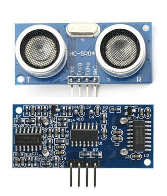

Device Description
******************
The device we will be demonstrating for our project is the ultrasonic wave sensor, the HC-SR04.

.. csv-table:: Device Features
   :header: "Feature", "Description"
   :delim: |

    Power Supply| +5V DC
    Quiescent Current| <2mA
    Working Current| 15mA
    Effectual Angle| <15°
    Ranging Distance| 2cm – 400 cm/1″ – 13ft
    Resolution| 0.3 cm
    Measuring Angle| 30 degree
    Trigger Input Pulse width| 10uS
    Dimension| 45mm x 20mm x 15mm

.. csv-table:: This device has 4 Pins
   :header: "PIN", "Description"
   :delim: |

    VCC| 5V, positive end of the power supply
    TRIG| Trigger Pin
    ECHO| Echo Pin
    GND| 0V, ground, negative end of the power supply

The TRIG and ECHO pins will be used to communicate from our microcontroller to the ultrasonic module. 

The HC-SR04 ultrasonic sensor is able to measure distances of objecs by utilizing sonar.

1. The transmitter (trig pin) sends a signal: a high frequency sound.

2. If the is an object in front of it, the signal will be reflected back.

3. The transmitter (echo pin) will receive the signal

How To Control the Device
*************************

Device Demonstration
********************

Project Code
************
